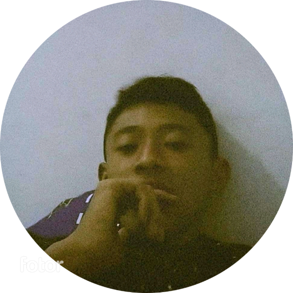

<!DOCTYPE html>
<html lang="en">
<head>
    <meta charset="UTF-8">
    <meta name="viewport" content="width=device-width, initial-scale=1.0">
    
    <title>HTML meilano dwi pranata</title>
    
</head>
<body>
    <audio autoplay> <source src="music.mp3" type="audio/mp3"> music </audio>

    

    <strong class="red-text">Meilano Dwi Pranata</strong>

    
Hello everyone, my name is Lano, I am a student at SMKN 1 Doko majoring in TKJ.

    
My hobby is electronics in the field of sound systems.

    
I'm interested in developing web programming and other programming languages I haven't tried yet..

    
My talent is daring to try new things.

    
My daily activities are school

    
I have the intention of learning a programming language.

    
I am interested in programming languages ​​because I want to work in indicators.

    
that's all from me assalamu'alaikum warahmatullahi wabarakatuh

    <button onclick="window.location.href = 'penutup.html';">Penutup</button>
    

<marquee class="red-text"behavior="scroll" direction="right">Terima Kasih telah membuka tugas dari saya!</marquee>

    

</body>
</html>
